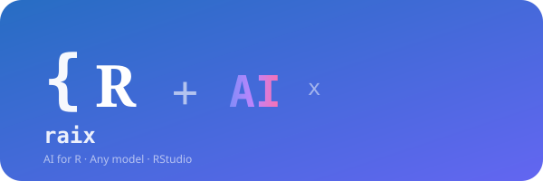
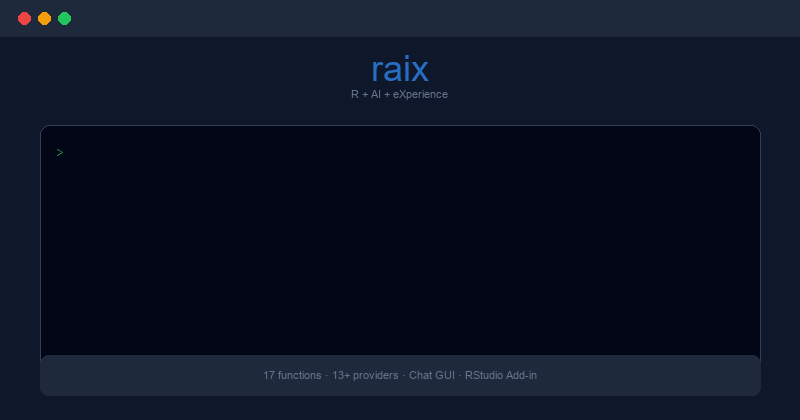

# raix 

<!-- badges: start -->
[](https://github.com/twomathematicians-code/raix/actions)
[](https://github.com/twomathematicians-code/raix)
[](LICENSE)
[](https://www.r-project.org/)
[](https://github.com/twomathematicians-code/raix#-supported-providers)
<!-- badges: end -->

<p align="center">
  
</p>

> **AI-powered coding assistant for R. Chat, explain, debug, and generate code — with any model, directly in RStudio.**

---

## Installation

```r
# Install from GitHub
remotes::install_github("twomathematicians-code/raix")
```

**Requirements:** R >= 4.0, [Ollama](https://ollama.com) (optional, for local models).

---

## Quick Start

```r
library(raix)

# One-command setup wizard
raix_setup()

# Or configure manually
raix_configure(provider = "ollama", model = "llama3.2")

# Start chatting
raix_chat()
```

---

## Features

- **Any model, any provider.** 13+ presets (OpenAI, Claude, Ollama, Groq, Mistral, DeepSeek, and more) plus any custom OpenAI-compatible endpoint.
- **Chat GUI.** Open `raix_gui()` for a full chat window in RStudio Viewer — configure models, switch providers, and chat without limits.
- **Code explanation.** `raix_explain("lapply(mtcars, mean)")` — get plain-English explanations of any R code.
- **Code generation.** `raix_generate("Create an interactive plotly scatter plot")` — turn descriptions into working R code.
- **Error debugging.** `raix_debug()` — run it right after an error and the AI diagnoses the root cause.
- **Roxygen documentation.** `raix_document("f <- function(x) x + 1")` — generate roxygen2 docs automatically.
- **CRAN package search.** `raix_search("time series")` — find relevant packages without leaving R.
- **Data analysis assistant.** `raix_analyze(mtcars)` — get AI-suggested analyses for any data.frame.
- **Script diagnosis.** `raix_diagnose("my_script.R")` — scan for missing packages, syntax errors, and anti-patterns.
- **Google search.** `raix_google("R tidyverse tutorial")` — search the web from R with AI summary.
- **Beginner-friendly.** `raix_setup()` walks first-time users through everything in under 2 minutes.
- **Privacy-first.** Ollama runs entirely locally — your code never leaves your machine.

---

## Supported Providers

| Provider | Setup | Best For |
|:---------|:------|:---------|
| **Ollama** | `ollama pull llama3.2` | Free, offline, private |
| **OpenAI** | API key required | Most capable (GPT-4o) |
| **Claude** | API key required | Long context, reasoning |
| **Groq** | Free tier available | Fast inference |
| **Mistral** | API key required | European AI |
| **DeepSeek** | API key required | Affordable code gen |
| **Together AI** | API key required | Open-source models |
| **LM Studio** | Local server | GUI for local models |
| **vLLM** | Local server | High-throughput local |
| **OpenRouter** | API key required | Multi-model gateway |
| **Perplexity** | API key required | Research-focused |
| **Custom** | Any URL | Bring your own endpoint |

All providers that expose an OpenAI-compatible `/v1/chat/completions` endpoint work automatically.

---

## Usage

### Console Chat

```r
library(raix)
raix_configure(provider = "ollama", model = "llama3.2")
raix_chat()

You> What does the `%>%` operator do in R?
raix> The `%>%` (pipe) operator comes from the magrittr package...
```

### GUI Chat

```r
raix_gui()  # Opens chat window in RStudio Viewer
```

### Code Assistance

```r
# Explain code
raix_explain("sapply(split(mtcars$mpg, mtcars$cyl), mean)")

# Debug your last error
raix_debug()

# Generate code from description
raix_generate("Create a heatmap of correlation matrix using ggplot2")

# Generate documentation
raix_document("f <- function(x) x^2")
```

### Data & Project Tools

```r
# Search CRAN for packages
raix_search("clustering")

# Get AI analysis suggestions for your dataset
raix_analyze(iris)

# Diagnose your R script
raix_diagnose("analysis.R")

# Search Google from R
raix_google("how to use pivot_longer in R")
```

---

## Configuration

```r
# Use a preset provider
raix_configure(provider = "openai", model = "gpt-4o", api_key = "sk-...")

# Use any custom OpenAI-compatible endpoint
raix_configure(
  provider = "my-api",
  model = "custom-model",
  base_url = "https://api.example.com/v1",
  api_key = "your-key"
)

# Check current configuration
raix_info()

# Test connectivity
raix_check()
```

---

## Contributing

Contributions are welcome! Please open an issue or pull request on [GitHub](https://github.com/twomathematicians-code/raix).

---

## License

MIT — see [LICENSE](LICENSE) for details.

---

Made with :heart: in R. [twomathematicians-code](https://github.com/twomathematicians-code)
