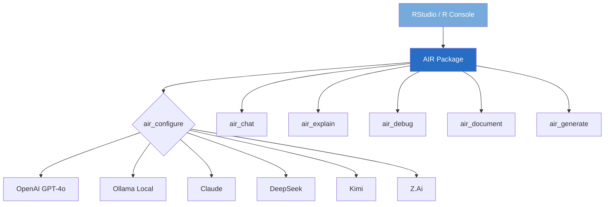

# AIR — AI for R

[](https://github.com/twomathematicians-code/air/actions)
[](https://www.r-project.org/)
[](LICENSE)
[](https://github.com/twomathematicians-code/air)

> **AI-powered coding assistant for R — live in your RStudio console.**

Chat with AI, explain code, debug errors, generate documentation, and write R functions from natural language — without leaving RStudio.

## 🧬 Architecture



## 🚀 Quick Start

```r
# Install from GitHub
remotes::install_github("twomathematicians-code/air")

# Configure (Ollama — free, local, private)
library(air)
air_configure(backend = "ollama", model = "llama3.2")

# Or OpenAI
air_configure(backend = "openai", model = "gpt-4o", api_key = "sk-...")
```

## 🎯 Usage

```r
# Chat interactively
air_chat()

# Explain R code
air_explain("lapply(mtcars, function(x) mean(x, na.rm = TRUE))")

# Debug the last error
air_debug()

# Generate documentation
air_document("my_func <- function(x, y) { x + y }")

# Write code from description
air_generate("Create a ggplot2 bar chart of mtcars mpg by cyl with custom colors")
```

## 🔌 Supported Backends

| Backend | Setup | Best For |
|:--------|:------|:---------|
| **Ollama** | `ollama pull llama3.2` | Free, private, offline |
| **OpenAI** | API key required | Most capable |
| **Claude** | API key required | Long context, reasoning |
| **DeepSeek** | API key required | Code generation |
| **Kimi** | API key required | Chinese + English |
| **Z.Ai** | API key required | Research models |

## 👤 Author

**Mahesh Solanki** — [GitHub](https://github.com/twomathematicians-code) · [LinkedIn](https://linkedin.com/in/maheshsolanki-16b9a6a5)

## 📄 License

MIT — see [LICENSE](LICENSE)
