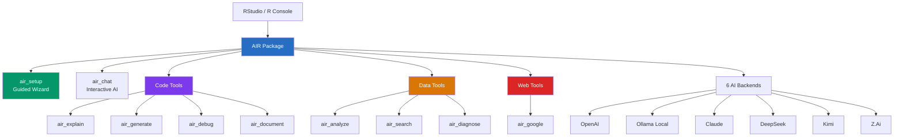

# raix — AI for R

[](https://github.com/twomathematicians-code/raix/actions)
[](https://www.r-project.org/)
[](https://github.com/twomathematicians-code/raix)
[](LICENSE)
[](https://github.com/twomathematicians-code/raix#-supported-backends)
[](https://github.com/twomathematicians-code/raix/actions)

> **AI-powered coding assistant for R — built for beginners, powerful for experts.**
> Chat, explain, debug, generate code, analyze data, search packages, and more — without leaving RStudio.

## 🧬 Architecture



## 🚀 Quick Start

```r
# Install
remotes::install_github("twomathematicians-code/raix")

# Option 1: GUI Chat (like ZCode)
library(air)
air_gui()                  # ← Opens chat window in RStudio Viewer

# Option 2: Guided setup
air_setup()                # ← 2-minute wizard

# Option 3: Console
air_chat()                 # ← Chat in your R console
```

## 📋 All Commands

### 🚀 Getting Started
| Command | What it does |
|:--------|:-------------|
| `air_setup()` | **Guided first-time setup wizard** — choose backend, test connection, quick tutorial |
| `air_help()` | Show all available commands organized by task |
| `air_info()` | Show current configuration |
| `air_check()` | Test if your AI backend is reachable |

### 💬 AI Chat & Search
| Command | What it does |
|:--------|:-------------|
| `air_chat()` | **Interactive chat session** with AI in your R console |
| `air_send("question")` | Send one message and get a response |
| `air_google("topic")` | **Search Google** from R + get AI summary |

### 📝 Code Development
| Command | Example |
|:--------|:--------|
| `air_explain("code")` | `air_explain("lapply(mtcars, mean)")` — explains R code |
| `air_generate("task")` | `air_generate("Create a ggplot bar chart of mtcars mpg by cyl")` |
| `air_debug()` | Run right after an error — AI diagnoses the problem |
| `air_document("fn")` | `air_document("f <- function(x) x^2")` — generates roxygen2 docs |

### 📊 Data & Project Tools
| Command | What it does |
|:--------|:-------------|
| `air_analyze(mtcars)` | **Guided data analysis** — gets AI suggestions for your dataset |
| `air_search("clustering")` | **Search CRAN packages** by topic |
| `air_diagnose("script.R")` | **Diagnose issues** in scripts — missing packages, syntax errors, anti-patterns |

### ⚙️ Configuration
| Command | What it does |
|:--------|:-------------|
| `air_configure(backend="ollama")` | Switch AI backend |
| `air_rstudio()` | Open AIR cheat sheet in RStudio Viewer pane |

## 🔌 Supported Backends

| Backend | Setup | Cost | Best For |
|:--------|:------|:-----|:---------|
| **Ollama** | `ollama pull llama3.2` | Free | Privacy, offline, beginners |
| **OpenAI** | API key required | Pay-per-use | Most capable |
| **Claude** | API key required | Pay-per-use | Long context reasoning |
| **DeepSeek** | API key required | Affordable | Code generation |
| **Kimi** | API key required | — | Chinese + English |
| **Z.Ai** | API key required | — | Research models |

## 🧪 Run a Full Demo

```r
library(air)

# 1. Setup
air_setup()

# 2. Search for packages
air_search("time series forecasting")

# 3. Analyze a dataset
air_analyze(mtcars)

# 4. Generate code
air_generate("Create an interactive plotly scatter plot of mtcars")

# 5. Explain existing code
air_explain("sapply(split(mtcars$mpg, mtcars$cyl), mean)")

# 6. Diagnose your project
air_diagnose(".")

# 7. Google something
air_google("R tidyverse tutorial")

# 8. Chat with AI
air_chat()
```

## 🧪 Test Results

```
User Simulation:   12/12 steps · 0 crashes
Edge Cases:        10/10 checks · 0 bugs
Unit Tests:        24/29 pass   · 5 skipped (need live AI)
```

## 👤 Author

**Mahesh Solanki** — [GitHub](https://github.com/twomathematicians-code) · [LinkedIn](https://linkedin.com/in/maheshsolanki-16b9a6a5)

## 📄 License

MIT — see [LICENSE](LICENSE)
