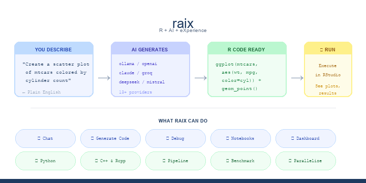
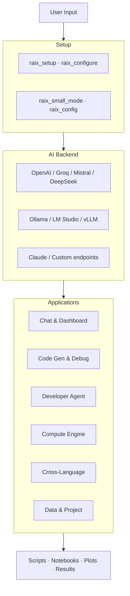
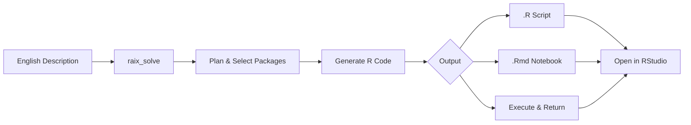

<p align="center">
  
</p>

<p align="center">
  <a href="https://github.com/twomathematicians-code/raix/releases"></a>
  <a href="https://github.com/twomathematicians-code/raix/actions"></a>
  <a href="LICENSE"></a>
  <a href="#"></a>
  <a href="#"></a>
</p>

**raix** connects RStudio to any AI model. Describe what you want in English — raix writes the R code, executes it, and shows results. Chat, debug, generate notebooks, run Python, compile C++, or launch a full coding dashboard.

```r
remotes::install_github("twomathematicians-code/raix")
library(raix)
raix_dashboard()    # self-configuring — auto-detects your AI
```

> [Installation help →](SOP.md) &nbsp;|&nbsp; [Release notes →](https://github.com/twomathematicians-code/raix/releases)

<br>

## Architecture



<br>

## Commands by Workflow

### Get Started
```r
raix_setup()          # auto-detect & configure — one click
raix_dashboard()      # full coding workspace in RStudio Viewer
raix_info()           # show current config
raix_config()         # get config as list (for scripts)
```

### Chat & Generate Code
```r
raix_chat()           # interactive AI chat in console
raix_gui()            # chat window in RStudio Viewer
raix_send("prompt")   # one message → one response
raix_explain("code")  # AI explains R code
raix_generate("task") # English → R code
raix_debug()          # diagnose last error
raix_document("fn")   # generate roxygen2 docs
```

### Developer Agent
```r
raix_solve("problem")        # complete solution from description
raix_script("task", "out.R") # generate .R file
raix_notebook("task", "out.Rmd") # generate .Rmd notebook
raix_test(my_function)       # AI writes testthat tests
raix_refactor(code)          # AI suggests improvements
raix_project(".")            # scan project for AI context
raix_package("task")         # find best R package
raix_read("file.R")          # read file with AI summary
raix_write("desc", "out.R")  # AI content → file
```

### Compute & Cross-Language
```r
raix_terminal("cmd")         # shell commands + AI analysis
raix_python("task")          # generate & run Python from R
raix_compile("task")         # C++ with Rcpp, compile, call from R
raix_pipeline(steps)         # multi-step cross-language workflow
raix_translate(code, to="python") # R ↔ Python
raix_sql("top 10 customers") # English → SQL
raix_simulate("Monte Carlo") # AI simulation engine
raix_web("https://...")      # fetch & summarize web pages
```

### Performance & Data
```r
raix_benchmark(expr)         # time code, AI suggests optimizations
raix_parallel("task")        # AI rewrites for multi-core
raix_analyze(mtcars)         # AI-guided data analysis
raix_search("topic")         # search CRAN packages
raix_diagnose("script.R")    # scan for issues & anti-patterns
raix_google("query")         # Google search + AI summary
raix_sysinfo()               # system info for AI context
raix_history()               # view/search chat history
```

<br>

## Developer Agent Flow



<br>

## Supported Models

| Local (free) | Cloud (API key) |
|:-------------|:----------------|
| Ollama · LM Studio · vLLM | OpenAI · Claude · Groq · Mistral |
| | DeepSeek · Together AI · Perplexity · OpenRouter |

**Small models?** raix auto-detects 7B-9B models and optimizes prompts. `raix_small_mode(TRUE)` for manual control.

<br>

## License

MIT © [Mahesh Solanki](https://github.com/twomathematicians-code) · [SOP.md](SOP.md) · `citation("raix")`
# raix = R + AI + eXperiment
# Contribution 2
